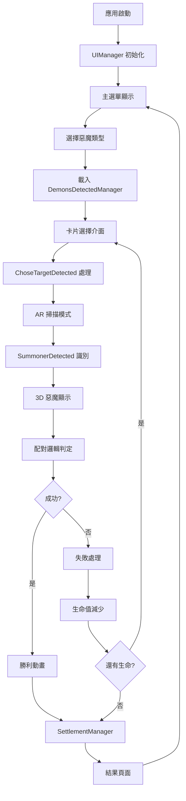

# MonsterAR 系統架構與資訊流程

## 🏗️ 系統架構概覽

### 核心系統組件
```
┌─────────────────────────────────────────────────────────────┐
│                    MonsterAR Application                    │
├─────────────────────────────────────────────────────────────┤
│  UI Layer          │  Game Logic        │  AR Layer        │
│  - UIManager       │  - DemonsDetected  │  - Vuforia       │
│  - SceneTransition │  - SettlementMgr   │  - SummonerDetected│
│  - AudioManager    │  - ChoseTarget     │  - ARButton      │
├─────────────────────────────────────────────────────────────┤
│                    Unity Engine Core                        │
│  - Scene Management │ - Animation System │ - Audio System  │
│  - PlayerPrefs     │ - DOTween         │ - TextMeshPro   │
└─────────────────────────────────────────────────────────────┘
```

## 📊 資訊流程圖

### 主要遊戲流程


## 🔧 核心系統詳解

### 1. UI 管理系統 (UIManager.cs)

**職責**：
- 場景切換控制
- 惡魔選擇邏輯
- 遊戲狀態管理
- PlayerPrefs 操作

**關鍵程式碼位置**：
```csharp
// 位置：Assets/Script/UIManager.cs:245-389
// 功能：惡魔選擇和狀態管理

public void BossChoose(int num) {
    // 設定惡魔編號
    PlayerPrefs.SetInt("BossNumber", num);
    
    // 切換到卡片選擇場景
    SceneTransition.Instance.ChangeScene("ChooseTarget");
}
```

**資料流**：
```
主選單 → 惡魔選擇 → PlayerPrefs 儲存 → 場景切換
```

### 2. 遊戲邏輯系統 (DemonsDetectedManager.cs)

**職責**：
- 卡片配對邏輯
- 勝負判定
- 生命值管理
- 遊戲狀態控制

**關鍵配對邏輯**：
```csharp
// 位置：Assets/Script/DemonsDetectedManager.cs:141-188
// 硬編碼的配對規則

private void BossDetectedFunction() {
    int bossNum = PlayerPrefs.GetInt("BossNumber");
    
    switch(bossNum) {
        case 1: // 忽視惡魔
            if (O != 3 && (R == 3 || R == 8) && (A == 3 || A == 7)) {
                isWin = true;
            }
            break;
        // ... 其他 7 種惡魔的邏輯
    }
}
```

**配對規則表**：
| 惡魔編號 | 惡魔類型 | O卡限制 | R卡範圍 | A卡範圍 |
|---------|---------|---------|---------|---------|
| 1 | 忽視 | ≠3 | {3,8} | {3,7} |
| 2 | 偏見 | ≠6 | {4,5} | {2,8} |
| 3 | 拒絕 | ≠1 | {1,6} | {1,4} |
| 4 | 羞恥 | ≠7 | {2,4} | {2,6} |
| 5 | 壓迫 | ≠8 | {5,7} | {5,8} |
| 6 | 無助 | ≠4 | {7,8} | {3,5} |
| 7 | 背叛 | ≠2 | {1,2} | {1,7} |
| 8 | 孤單 | ≠5 | {3,6} | {4,6} |

### 3. AR 識別系統 (SummonerDetected.cs)

**職責**：
- Vuforia 圖像識別
- 3D 模型顯示控制
- 觸控旋轉功能
- 追蹤狀態管理

**追蹤流程**：
```csharp
// 位置：Assets/Script/SummonerDetected.cs:89-156

public void OnTrackingFound() {
    // 顯示 3D 模型
    SummonerObject.SetActive(true);
    
    // 根據惡魔類型載入對應模型
    int bossNum = PlayerPrefs.GetInt("BossNumber");
    LoadDemonModel(bossNum);
}

public void OnTrackingLost() {
    // 隱藏模型，保持 UI
    SummonerObject.SetActive(false);
}
```

**識別狀態**：
```
NO_POSE → TRACKING_FOUND → EXTENDED_TRACKING → TRACKING_LOST
```

### 4. 卡片選擇系統 (ChoseTargetDetected.cs)

**職責**：
- 三種卡片選擇 (R, O, A)
- 選擇狀態同步
- 視覺回饋處理

**選擇流程**：
```csharp
// 位置：Assets/Script/ChoseTargetDetected.cs:45-89

public void RCardChoose(int cardNum) {
    // 更新 R 卡選擇
    PlayerPrefs.SetInt("RCard", cardNum);
    
    // 同步到 DemonsDetectedManager
    demonsDetectedManager.R = cardNum;
    
    // 更新 UI 顯示
    UpdateCardDisplay();
}
```

## 🔄 資料流轉

### 1. 遊戲狀態管理
```
PlayerPrefs (持久化) ←→ Manager Scripts (運行時) ←→ UI Components (顯示)
```

**關鍵 PlayerPrefs 鍵值**：
- `BossNumber`: 選擇的惡魔類型 (1-8)
- `RCard`, `OCard`, `ACard`: 選擇的卡片編號
- `ResetLevel`: 重置關卡標記
- `TargetNumber`: 目標編號

### 2. 場景間資料傳遞
```
Main Menu → Choose Boss → Choose Cards → AR Scan → Result
    ↓           ↓            ↓           ↓        ↓
PlayerPrefs → PlayerPrefs → PlayerPrefs → 運行時 → 清除
```

### 3. AR 系統資料流
```
Vuforia Camera → Image Recognition → Tracking Events → 3D Model Control
                                          ↓
                                   Game Logic Trigger
```

## 🔧 重要系統介面

### 1. 惡魔管理介面
```csharp
// 惡魔類型定義
public enum DemonType {
    Ignore = 1,      // 忽視
    Prejudice = 2,   // 偏見  
    Rejection = 3,   // 拒絕
    Shame = 4,       // 羞恥
    Oppression = 5,  // 壓迫
    Helplessness = 6, // 無助
    Betrayal = 7,    // 背叛
    Loneliness = 8   // 孤單
}
```

### 2. 卡片系統介面
```csharp
// 卡片選擇結構
public struct CardSelection {
    public int RCard;  // 1-8
    public int OCard;  // 1-8  
    public int ACard;  // 1-8
    
    public bool IsValidCombination(int demonType);
}
```

### 3. AR 追蹤介面
```csharp
// AR 狀態回調
public interface IARTrackingHandler {
    void OnTrackingFound();
    void OnTrackingLost();
    void OnTrackingExtended();
}
```

## ⚠️ 系統限制與問題

### 1. 架構問題
- **雙套系統並存**：`DemonsDetectedManager` vs `MonsterGameManager`
- **職責分散**：UI 邏輯和遊戲邏輯耦合
- **硬編碼規則**：配對邏輯寫死在程式碼中

### 2. 資料流問題
- **過度依賴 PlayerPrefs**：狀態管理不夠靈活
- **缺乏驗證機制**：沒有資料完整性檢查
- **錯誤處理不足**：異常情況處理缺失

### 3. 性能問題
- **頻繁的 PlayerPrefs 操作**：可能影響性能
- **未優化的 UI 更新**：每幀更新可能過度
- **記憶體管理**：3D 模型載入/釋放需要優化

## 🚀 緊急修復策略

### 短期解決方案
1. **保留現有雙套系統**：避免大幅重構
2. **增加錯誤檢查**：在關鍵位置添加防護代碼
3. **優化 PlayerPrefs 使用**：減少讀寫頻率

### 長期改善建議
1. **統一系統架構**：合併重複功能
2. **引入配置系統**：使用 ScriptableObject 管理規則
3. **實現狀態機**：標準化遊戲狀態管理

---

*最後更新：2025-07-17*
*緊急狀態：準備交件 - 優先穩定性*